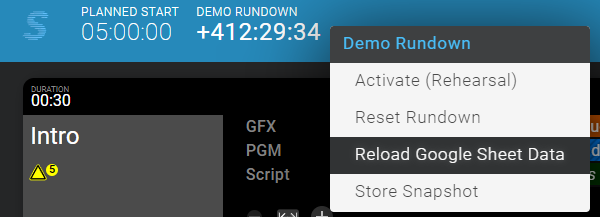

# Sofie Rundown Editor

> A tool for creating and editing rundowns in a _demo_ environment of [Sofie](https://github.com/Sofie-Automation/Sofie-TV-automation/).


## Prerequisites

Sofie Rundown Editor requires that you have a working instance of [Sofie Core](https://github.com/Sofie-Automation/sofie-core) release 53 with the [demo blueprints](https://github.com/SuperFlyTV/sofie-demo-blueprints) uploaded to it. You do not need to install the [spreadsheet-gateway](https://github.com/SuperFlyTV/spreadsheet-gateway).

## Installation

Deploy the docker container using the `docker-compose.yml`, modify the port, volume mapping as needed. When migrating from a local install, the `data.db` file should be copied to the directory which the data volume points to otherwise the container will initialize a new database on the first run.

Once up and running in Rundown Editor go to `Settings -> Core Connection` and set the address and port of your Sofie instance. This is stored in your database file.

## Usage (Quick Start / Demo)

1. Begin by navigating to the Settings page in the top right.
2. Enter the URL and port of your Sofie instance (defaults to `127.0.0.1:3000`).
3. Click "Save".
4. Download and import [this demo set of Piece Types](https://raw.githubusercontent.com/SuperFlyTV/sofie-demo-blueprints/main/assets/sofie-rundown-editor-piece-types.json) (right click and "Save link as...") on the Settings page.
5. Before continuing, open the Sofie Core interface, navigate to the Settings page, click on your Studio, and attach `sofie-rundown-editor` as a Device by clicking the plus sign (+) under "Attached Devices".
6. Back in Rundown Editor, navigate to the Rundowns page in the top right.
7. Download and import [this demo Rundown](https://github.com/SuperFlyTV/sofie-automation-rundown-editor/raw/main/demo-rundown.json) (right click and "Save link as...")
8. Click on the Rundown and ensure that the "Sync to Sofie" box is checked. Be sure to click Save if you changed the setting.
9. Open the Rundown in Sofie.

> 💡 If at any point you need to re-ingest a rundown (for example, to pick up changes to the blueprints), perform the following procedure:
>
> 1. Ensure that Rundown Editor is running and connected to Sofie Core.
> 2. In the Sofie Core web UI, open the rundown you wish to re-ingest.
> 3. Right click on the header and click "Reload Google Sheet Data" (in a future version of Sofie Core, this will say "Reload Rundown Editor Data")
>
>    

## For Developers

### Project setup

```
yarn install
```

### Compiles and hot-reloads for development

In one terminal

```
yarn dev
```

The frontend with hot-reloads will be available at `http://localhost:5173/`

### Compiles and minifies for production

```
yarn build
```

### Lints and fixes files

```
yarn lint
```

### Making a new release

1. Merge everything for the release in main
2. Wait for release-please to open a PR for the changes
3. Make sure the changelog and new version number it proposes are sensible.
   If not, release-please has some commands to adjust that.
4. Merge the PR
5. Wait for the release-please workflow to create the new tag
6. Wait for the workflows to [`Create GitHub Release`](https://github.com/SuperFlyTV/sofie-automation-rundown-editor/actions/workflows/create-release.yaml) action to finish
7. Go to the [releases](https://github.com/SuperFlyTV/sofie-automation-rundown-editor/releases) page and publish the draft release
