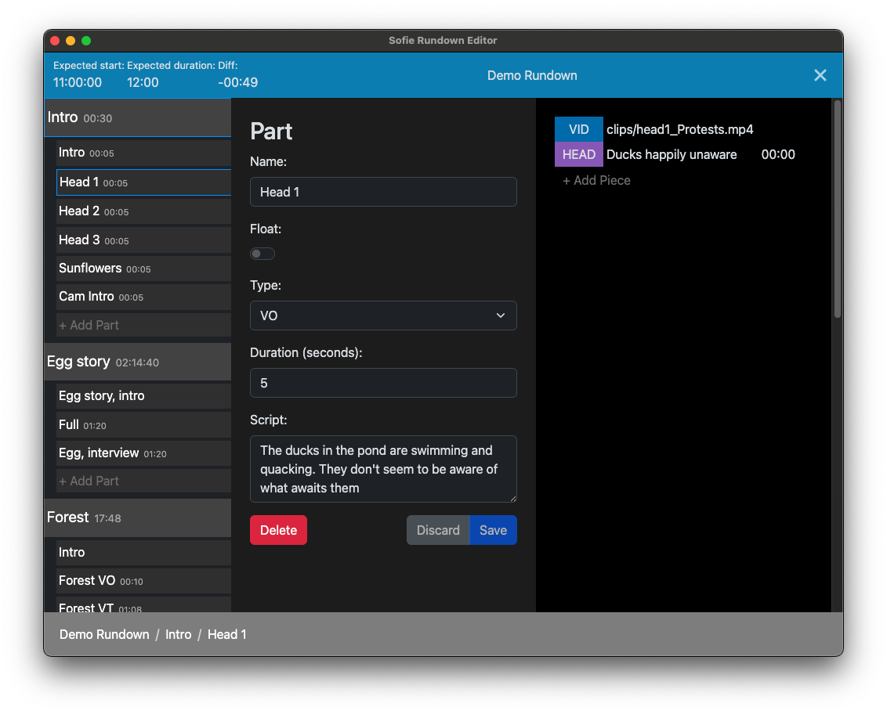

# Sofie Rundown Editor

> A tool for creating and editing rundowns in a _demo_ environment of [Sofie](https://github.com/nrkno/Sofie-TV-automation/).



## Prerequisites

Sofie Rundown Editor requires that you have a working instance of [Sofie Core](https://github.com/nrkno/tv-automation-server-core) release 37 with the [spreadsheet blueprints](https://github.com/SuperFlyTV/sofie-blueprints-spreadsheet) uploaded to it. You do not need to install the [spreadsheet-gateway](https://github.com/SuperFlyTV/spreadsheet-gateway).

> 💡 You can download the blueprints `bundle.json` from the [latest release](https://github.com/SuperFlyTV/sofie-blueprints-spreadsheet/releases) of `sofie-blueprints-spreadsheet`.

## Installation

Head to the [releases](https://github.com/SuperFlyTV/sofie-automation-rundown-editor/releases) page and download the installer for the latest release. You'll find installers for Windows, Linux, and macOS on listed under the Assets dropdown for each release.

## Usage (Quick Start)

1. Begin by navigating to the Settings page in the top right.
2. Enter the URL and port of your Sofie instance (defaults to `127.0.0.1:3000`).
   - ❗ Restart the program after changing this setting! (be sure to hit "Save" first, though)
3. Click "Save".
4. Download and import [this example set of Piece Types](https://github.com/SuperFlyTV/sofie-automation-rundown-editor/raw/master/example-pieces-manifest.json) (right click and "Save link as...").
5. Before continuing, open the Sofie Core interface, navigate to the Settings page, click on your Studio, and attach `sofie-rundown-editor` as a Device by clicking the plus sign (+) under "Attached Devices".
6. Back in Rundown Editor, navigate to the Rundowns page in the top right.
7. Download and import [this example Rundown](https://github.com/SuperFlyTV/sofie-automation-rundown-editor/raw/master/example-rundown.json) (right click and "Save link as...")
8. Open the Rundown in Sofie.

## For Developers

### Project setup

```
yarn install
```

### Compiles and hot-reloads for development

```
yarn electron:serve
```

### Compiles and minifies for production

```
yarn electron:build
```

### Lints and fixes files

```
yarn lint
```

### Customize configuration

See [Configuration Reference](https://cli.vuejs.org/config/).

### Making a new release

1. Bump `version` in [`package.json`](package.json)
2. Commit and push the change as `chore: release vX.Y.Z`
3. Tag that commit as `vX.Y.Z.` and push the tag
4. Wait for the [`Create GitHub Release`](https://github.com/SuperFlyTV/sofie-automation-rundown-editor/actions/workflows/create-release.yaml) action to finish
5. Go to the [releases](https://github.com/SuperFlyTV/sofie-automation-rundown-editor/releases) page and publish the draft release
